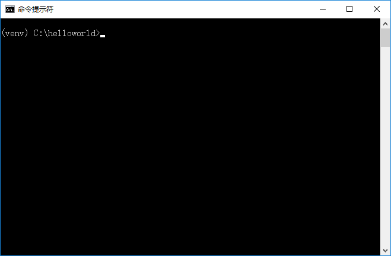
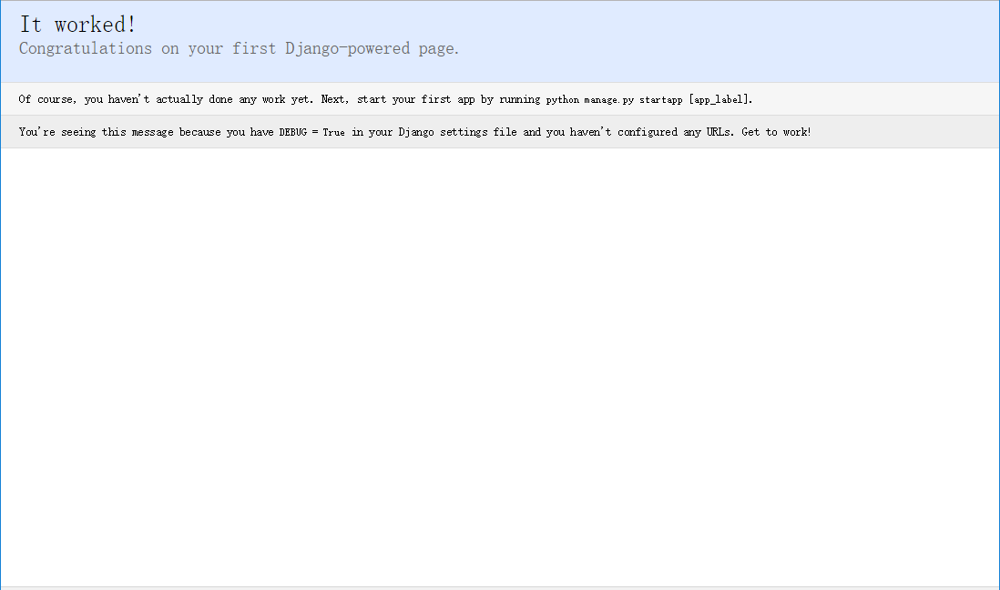
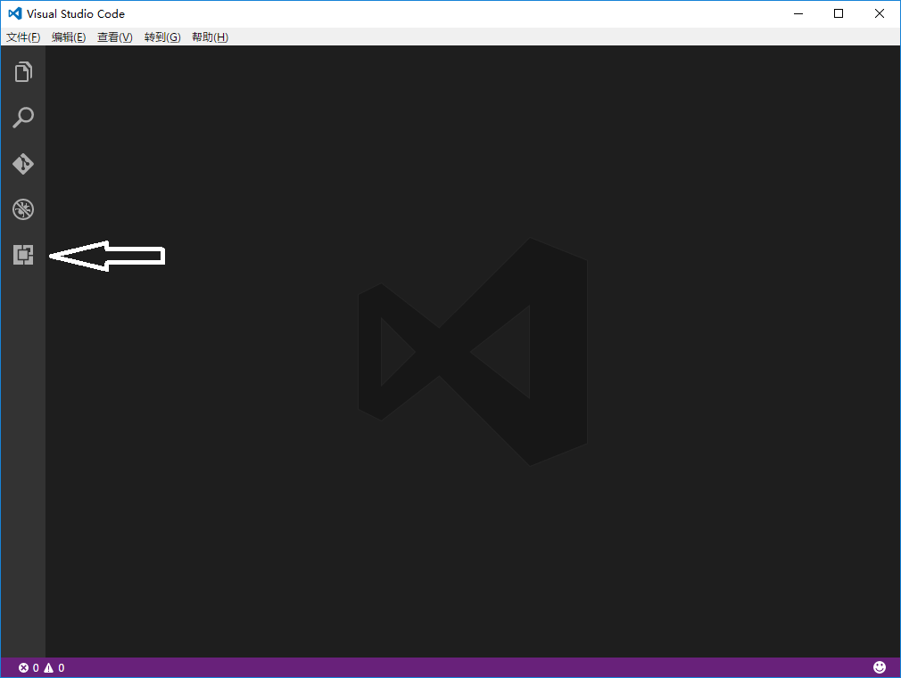
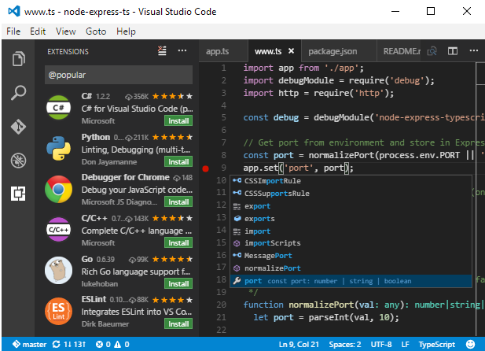

# 搭建Python开发环境
--------------------------------------------------

## 安装Python

Python的开发环境是比较简单的，到[https://www.python.org/downloads/](https://www.python.org/downloads/)去下载对应的Python3安装包，安装的时候勾选上修改PATH的选项，然后完成安装就是了。本文使用的是Python 3.5.2。

调出你的终端（cmd），输入

```
    python
```

如果出现下面的提示，那么说明你已经安装成功了。


Python环境搭好之后首先要做的就是这个：

```
    print('hello world!')
```

恭喜你！

## 安装virtualenv

virtualenv可以建立多个独立的虚拟环境，各个环境中拥有自己的python解释器和各自的package包，互不影响。
使用Python自带的pip工具可以很方便的安装、卸载和管理Python的包。

```
    pip install virtualenv
```

pip和virtualenv可以很好的协同工作，同时使用这两个工具非常方便。
用virtualenv env1就可以创建一个名为env1的虚拟环境了，进入这个虚拟环境后，再使用pip install安装其它的package就只会安装到这个虚拟环境里，不会影响其它虚拟环境或系统环境。
接下来我们要用这个工具创建我们自己的开发环境。

## 安装Django1.10

为了能够使用Django的命令行，我们把Django安装到系统的环境中，在命令行中输入：

```
    pip instal django
```

就可以完成安装。

## 创建第一个Django项目

为了能够统一的管理工程的代码等信息，我们将工程代码和virtualenv环境都放在同一个目录中，这样无论这个目录拷贝到哪里，都可以直接加载环境之后开始运行，首先输入下面的命令创建第一个django项目：

```
    C:\>django-admin startproject helloworld
    C:\>cd helloworld
```

然后我们在helloworld目录下面创建一个venv的目录，保存这个Django项目的虚拟环境，之后我们在这个虚拟环境中安装Django1.10

```
    C:\helloworld\>virtualenv venv
    C:\helloworld\>venv\scripts\activate
    (venv) C:\helloworld\>pip install django
    (venv) C:\helloworld\>
```

这个时候你应该可以看到提示符前面增加了“(venv)”的字样，如下所示：



这个时候你的virtualenv就已经激活了，如果你再输入`python`命令：
的时候，就会使用这个虚拟环境下面的Python。请注意，下面的教程我么都是在这个环境下面运行的。

下面让我们运行一下我们的第一个Django项目。如果你运行了`python`命令，输入`exit()`退出。在命令行下面输入：

```
    (venv) C:\helloworld\>python manage.py runserver
```

然后使用浏览器打开这个地址[http://localhost:8000/](http://localhost:8000/)就可以看到一个欢迎页面了。



在命令行下面使用`Ctrl+C`可以退出这个Django项目。

## 安装Visual Studio Code作为Python IDE

访问<https://code.visualstudio.com>下载Visual Studio Code（简称VS Code）客户端，然后安装。打开后会看到如下的界面。


点击箭头所指的`扩展`按钮，输入`@popular`，就会显示最流行的扩展清单，选择Python扩展进行安装。



由于我们的virtualenv目录会放到Python项目的venv子目录下，所以我们要对Python扩展进行一点设置。在VS Code菜单中选择“文件”->“首选项”->“用户设置”，就会打开用户设置的文件`settings.json`，输入如下信息指定我们的Python环境路径：

```
{
    "python.pythonPath": "${workspaceRoot}/venv/scripts/python.exe",
}
```

## 使用VS Code打开helloworld

在helloworld目录下输入：

```
    (venv) C:\helloworld\>code .
```

即可使用VS Code打开helloworld工程。VS Code没有工程描述文件，一个目录就是一个工程，后面的例子我们都用这个开发工具完成。

## 完结！ 

--------------------------------------------------

### 继续阅读[简明Python教程](../a-byte-of-python3/index.md)